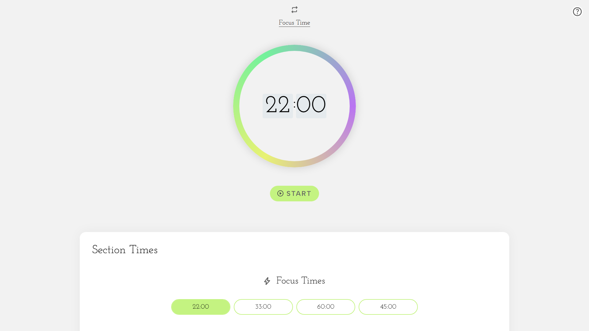
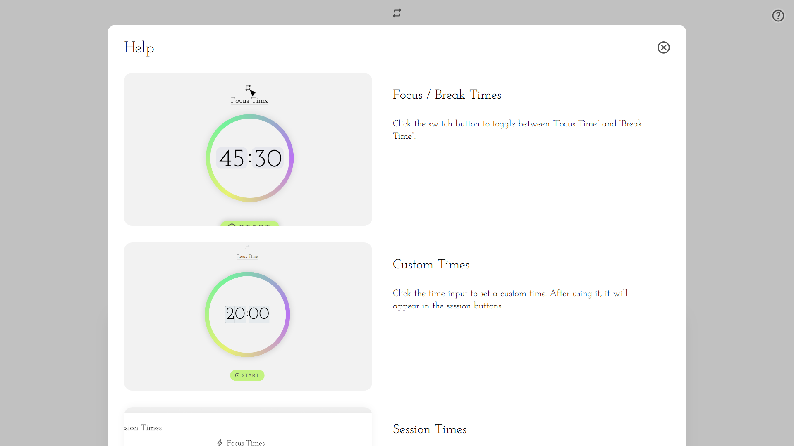
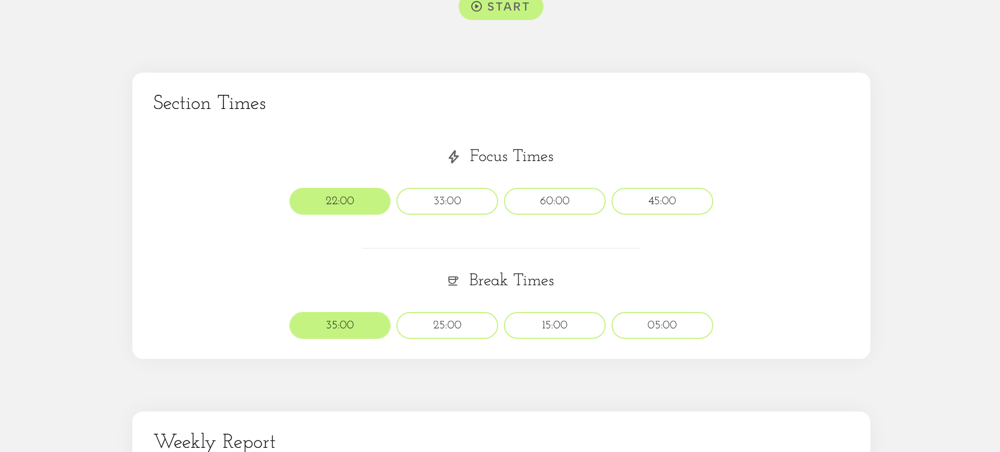
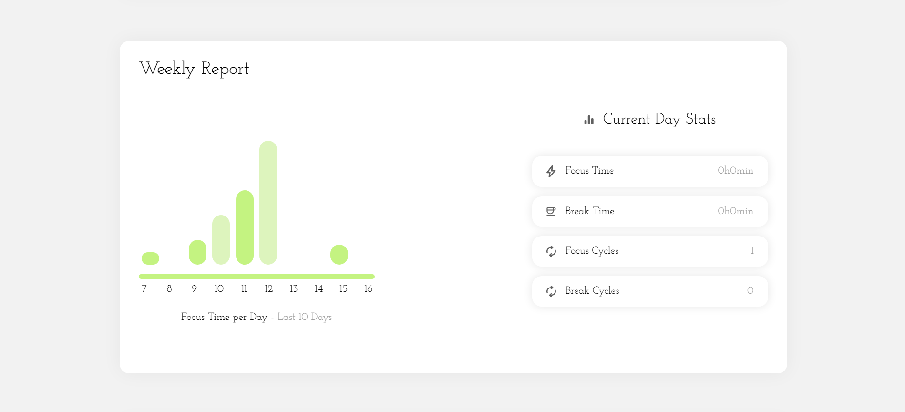

# Timer WebApp

A productivity-focused timer with focus and break modes, daily and weekly stats, and a clean, interactive interface. Ideal for techniques like Pomodoro.

<br>

## Features

* Switch between **Focus Time** and **Break Time**;
- Input custom times or choose predefined ones;
* Daily time stats and weekly graph;
- Animated and responsive interface;
* Data persistence.
- Responsive in all devices.

<br>

## About Me

##### Hi, I'm Daniel Almeida. 👋

I created this project to deepen my knowledge of CSS and JavaScript. Building this timer app taught me a lot about organising code effectively and creating systems that work well together.

It was also a great chance to explore design and frontend development practices in a practical way. I enjoy developing projects that challenge me and help me grow as a developer.

<br>

## Getting Started

* Click the link below to run the website, or clone this repository and open the `index.html` file on your computer.
<br>

[Timer WebApp Link](https://dani234jf.github.io/Web-App-Timer-project)

<br><br>

## Screenshots

<br><br>


<br>

<br>

<br>


<br><br>


## Technologies

* HTML
* CSS 
* JavaScript (no frameworks)
* `localStorage`, for data storage
* No backend used

<br><br>

## Structure
```bash
 📂 root/
  ├️ 📄 index.html
  ├️ 📄 style.css
  ├️ 📄 script.js
  ├️ 📄 read-me.md
  ├️ 📁 Assets ...
  ┗️ 📁 Screenshots ...
```
